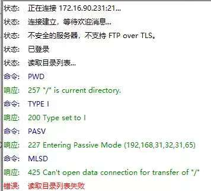
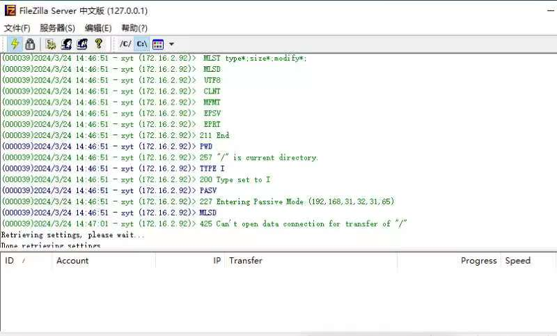
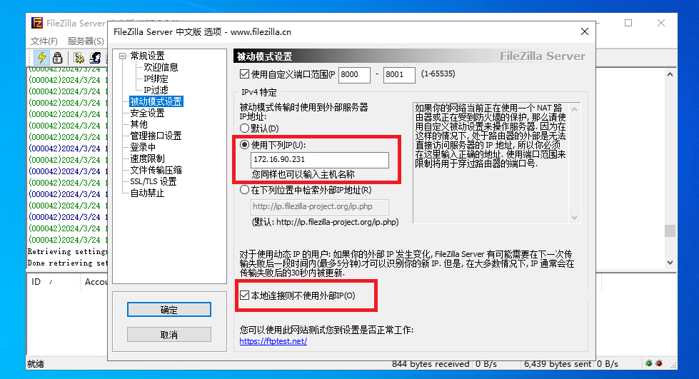
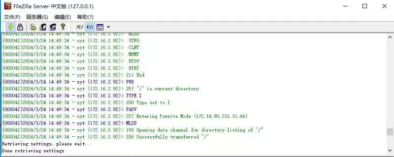

# 问题
先介绍下网络环境，外网——服务器1——服务器2。服务器1做路由用，服务器2上安装FileZilla作为ftp的服务端，客户端与服务器1在一个网段下，与服务器2不在一个网段

结果在客户端使用FileZilla的时候遇到了问题，具体表现为：

主动模式下可以正常连接，被动模式下报错**读取目录失败**：
``` 425 Can't open data connection for transfer of "/" ``` 

客户端报错：



服务端报错：



# 排查方向
于是开始了痛苦排查之路：
- STEP1.确认FileZilla是否打开被动模式，是否勾选使用自定义端口范围
- STEP2.确认服务器2端口是否真的打开
  

  *需要在客户端发送请求时，开启对服务器2端口的扫描，因为被动模式下是动态开放端口，经确认已开启端口*
- STEP3.确认是否在服务器1上开启端口转发，以及端口是否真的被打开
  

  *在客户端发送请求时，开启对服务器1端口的扫描，经确认已开放端口*

但是这个时候陷入了瓶颈，明明端口都开着，也都扫到了，为什么过了一会儿就会发现端口被关闭以及报错了呢？

上百度检索找到两个解决方案：
- 1.退回到主动模式（但我配置的就是被动模式！！退回主动模式和我的需求不符）
- 2.在FileZilla中勾选使用自定义端口范围（emmm...具体参考我的第一步）
  
于是爬出去看了看谷歌上的论坛，终于找到一个靠谱的解释：

PASV的响应`227 Entering Passive Mode（192，168，31，32，31，65）`中可以看到这个IP地址是服务器2的IP地址，是一个私有的IP地址，不能被外网访问到。在这一步中我们需要返回的是服务器1的IP地址+端口号
>Ip地址解读为：192.168.31.32，端口号为：31*256+65=8001，所以该完整地址为：192.168.31.32:8001

# 解决方案
知道了错误原因就很好解决了，如图：
- 1.在被动模式下使用静态的公共的IP
  
  >这里因为在服务器1上设置了端口转发，所以留的是服务器1的IP地址，如果FTP服务器直连外网的话需要留的是公网IP
- 2.勾选本地连接则不使用外部IP
  
  ~~这个猜测是个历史遗留Bug，不勾选的话上述配置会不生效~~



最后晒一下成功截图
