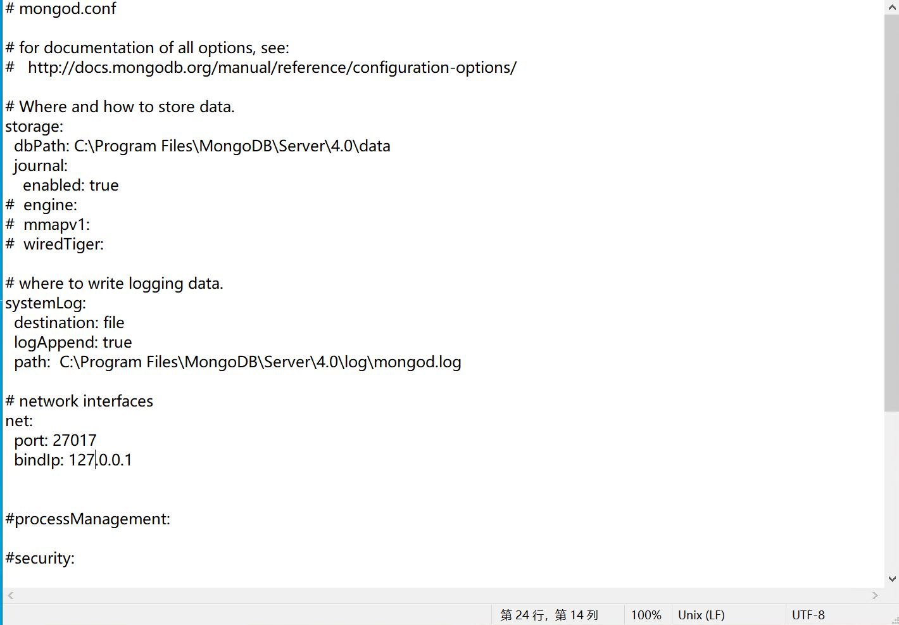
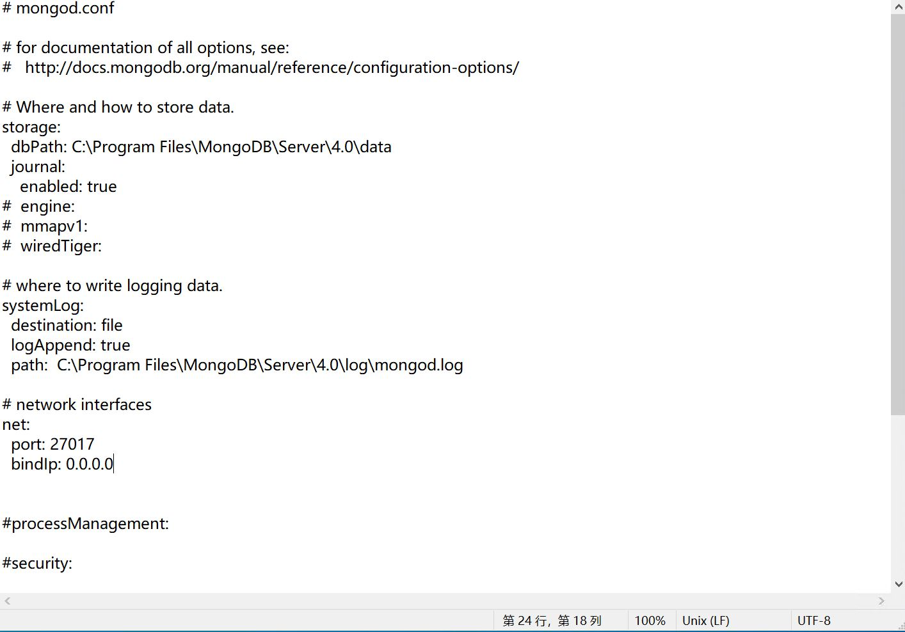
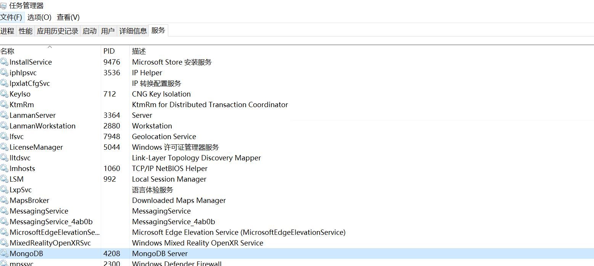

# 修复了MongoDB数据库无法远程连接的问题
## 排查方向：
**1. 确认防火墙是否关闭或防火墙规则是否正确**

**2. 修改/MongoDB/Server/版本号/bin/mongod.cfg文件**
从
 ```
net:
  bindIp:127.0.0.1
```

修改为
```
net:
  bindIp:0.0.0.0
```


**3. 重启mongoDB服务**
