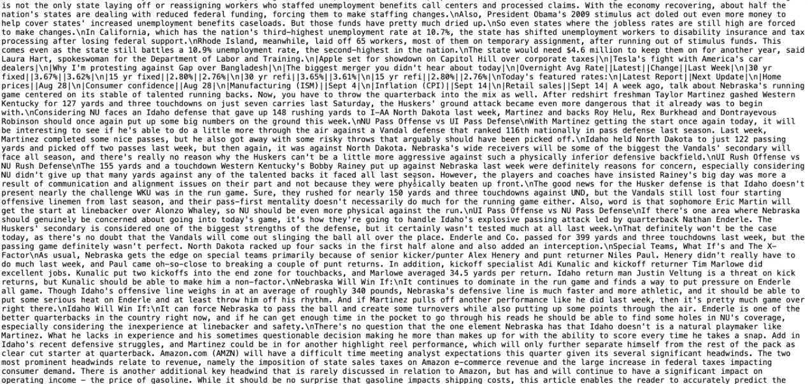
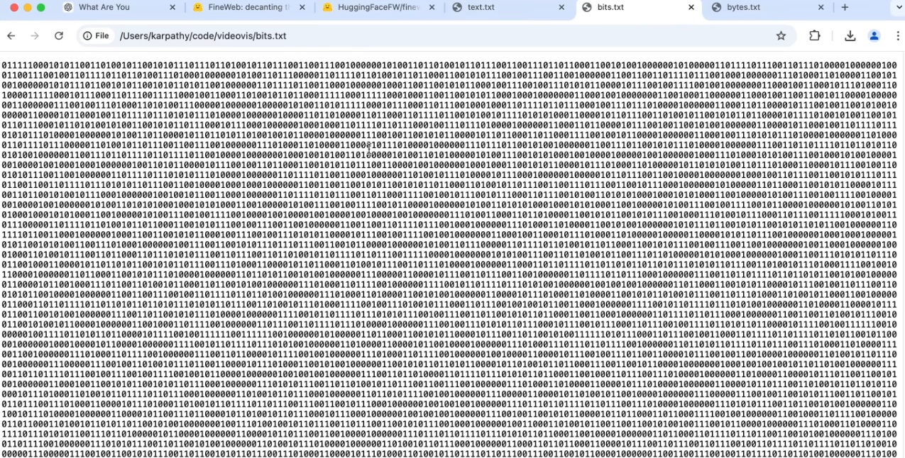
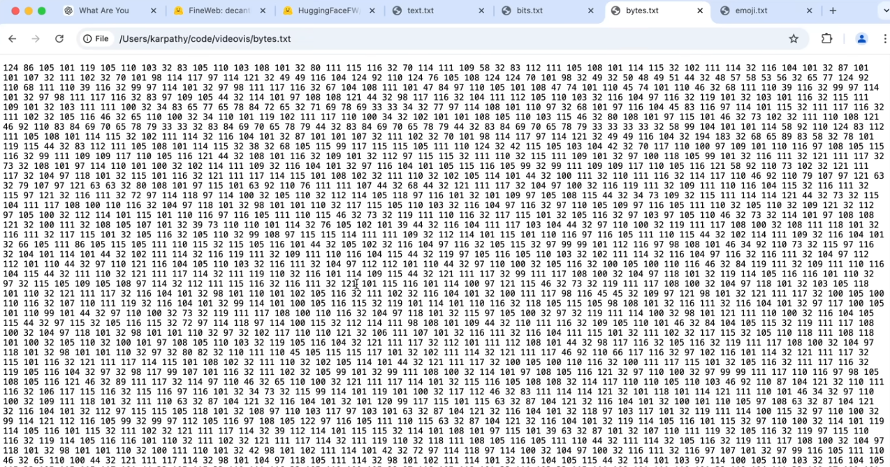
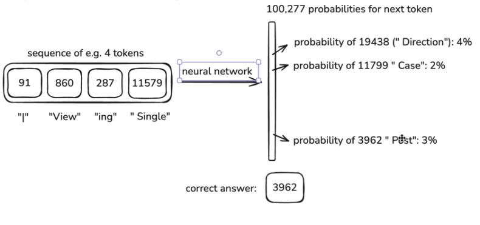
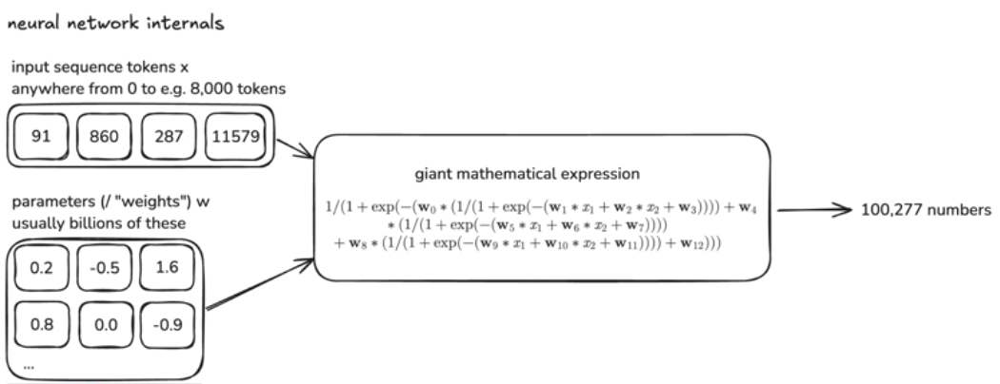

# Week 1: Introduction to Coding LLMs and AI Development
## 预训练数据来自于哪里？
首先先从互联网上的页面上提取出文字（带p标签的那种）。

然后转换为0/1序列，但这样会产生一个问题，会出现很长的一条只有0/1组成的序列，

我们想要的是更短、词汇更丰富的，所以需要压缩序列。

就像这样，这就是一个8合1。
接下去就是不断用新的符号去代替，然后序列因此变得更短。
这些符号我们称之为**token**，这个过程我们称之为**tokenization**
不同的分词方式会导致token数量不同。
这个一维序列中的数字都只是代表id，不具有实际数字含义，而这个一维序列就是预训练的数据。
在这个网站上可以看到一些token的转换实例：https://tiktokenizer.vercel.app
## 如何训练神经网络？
建立tokens在序列中如何排列的统计关系模型。
将长度可变的tokens序列（context 上下文）输入到神经网络中。这里的tokens序列我们称之为context（上下文）。这个上下文如何得来呢？在原始数据中随机“开窗”，即裁切一段连续的数据。windows（窗口）是连续的一段序列，长度理论上是0~某个最大值，但是越长、越多的窗口需要的计算资源就越多。通常使用4000/8000/16000作为窗口长度。
在训练初期，因为神经网络是随机初始化的，所以输出的可能性（probability）也会非常随机.所以我们需要运用数学方法来提高正确答案出现的概率。

一旦我们使用了数学方法来更新了这个神经网络，这种更新不止针对这一个窗口，还针对这个数据中挖出的每一个窗口。这整个过程被称为神经网络的训练。
那么神经网络内部的结构是什么呢？

输入的那些tokens序列和神经网络的参数（权重）被混合成一个巨大的数学模型。可能存在上亿个这样的参数。最初这些参数是完全随机设置的，因此输出的预测结果也是完全随机的。但是随着不断地训练，输出的结果也会越来越接近实际的情况。神经网络训练实际上就是发现一组参数的最佳设置，所以神经网络架构研究的主题就是设计有效的数学表达式。
在这个网站上，可以看到大模型的可视化展示样本：https://bbycroft.net/llm
## 模型推理是什么？

