最近因为一些原因，不得不直接进数据库改数据，于是有了这篇博客。

在MongoDB中，**Query**、**Projection**和**Order**是常用的查询操作，分别用于筛选数据、指定返回字段和排序结果。
以下是详细的介绍和用法：

假设表中存在以下结构的数据：
```
{
  "_id" : 1,
  "name" : "David",
  "age" : 16,
  "friends" : [{
      "id" : 2,
      "name" : "Lucy",
      "othermessage" : {
        "hobby" : "travel",
        "height" : "165",
        "weight" : "60kg"
      }
    }, {
      "id" : 3,
      "name" : "rebecca",
      "othermessage" : {
        "hobby" : "shot",
        "height" : "155",
        "weight" : "45kg"
      }
    }],
    "interests":["reading","writing"]
},
{
  "_id" : 2048,
  "name" : "yamako",
  "age" : 24,
  "friends" : [{
      "id" : 2020,
      "name" : "alice",
      "othermessage" : {
        "hobby" : "dance",
        "height" : "165",
        "weight" : "50kg"
      }
    }, {
      "id" : 2024,
      "name" : "penta",
      "othermessage" : {
        "hobby" : "dance",
        "height" : "150",
        "weight" : "45kg"
      }
      }],
      "interests":["singing","dancing"]
}
```
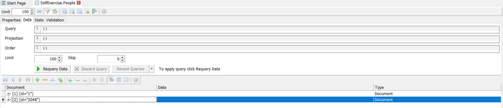

## Query（查询）
   
Query用于指定查询条件，以筛选集合中的文档。可以使用各种条件运算符来构建查询。

1. 查询特定字段的文档:
   
   ```{"name":"David"}```
    
    返回**name**为**David**的整条条目
  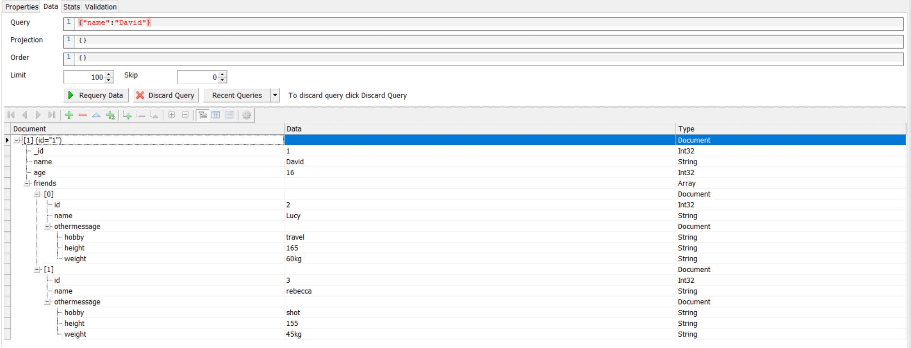

2. 使用比较运算符:
   
   ```{"age":{$gt:20}}```
    
    返回**age**大于**25**的整条条目
  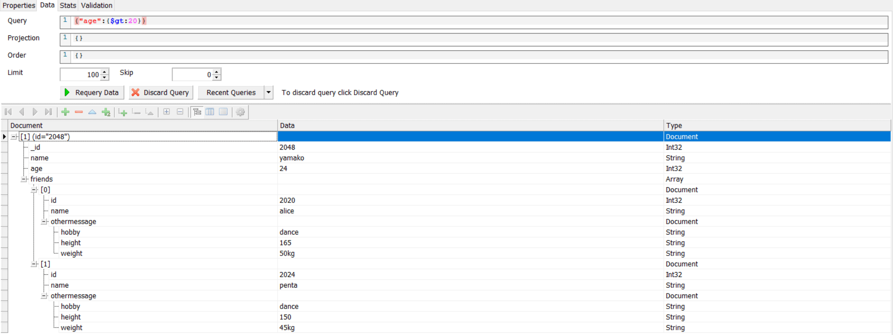

    常用的比较运算符有：
   * $eq(等于)
    
      示例：
      ```{"age":{$eq:20}}```

   * $ne(不等于)
  
     示例：
    ```{"age":{$ne:20}}```

   * $gt(大于)

      示例：
    ```{"age":{$gt:20}}```

   * $gte(大于或等于)

      示例：
    ```{"age":{$gte:20}}```

   * $lt(小于)

      示例：
    ```{"age":{$lt:20}}```

   * $lte(小于或等于)

      示例：
    ```{"age":{$lte:20}}```

   * $in(在数组中)

      示例：
    ```{"age":{$in:[25,30,35]}}```

   * $nin(不在数组中)

      示例：
    ```{"age":{$in:[25,30,35]}}```

3. 查询嵌套字段:

   ```{"friends.name":"alice"}```

    返回**friends.name**为**alice**的整条条目
  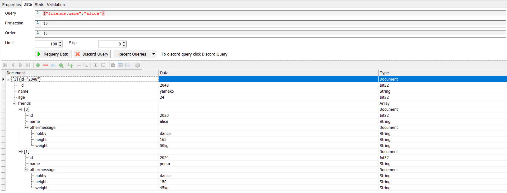

4. 查询数组中的元素

    ```{"interests":"reading"}```
       
      返回**interests**里包含**reading**的整条条目
  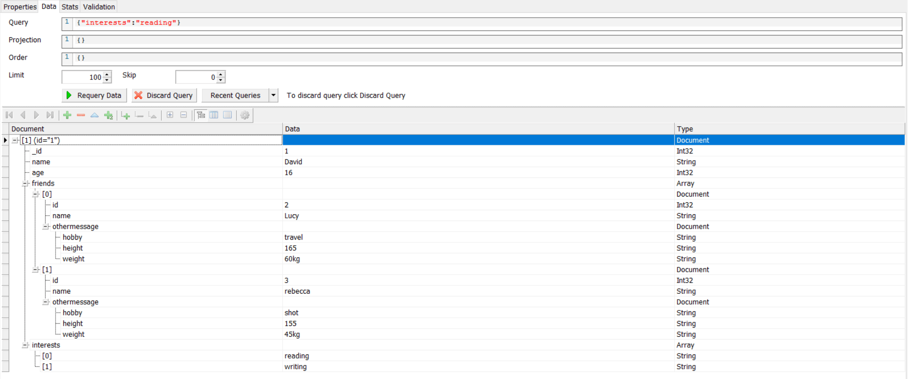

## Projection(投影)

Projection用于指定查询结果中应包含或排除的字段，可以在查询中使用投影来返回必要的字段

1. 包含特定的字段
  
    ```
      Query:{"name":"yamako"}
      Projection:{"name":1,"age":1}
    ```

    只返回**name**和**age**字段，其他字段不显示
  
    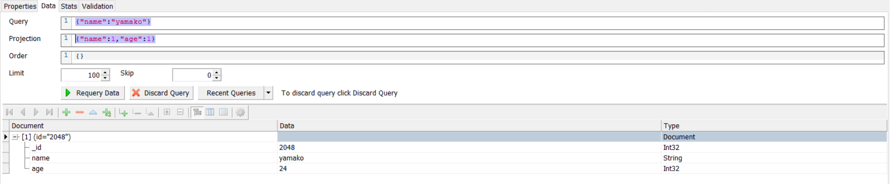

    > id是比较特殊的字段，默认会显示，除非加上"_id":0
      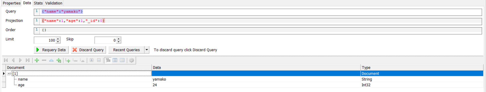

2. 排除特定的字段
  
    ```
      Query:{"name":"yamako"}
      Projection:{"age":0}
    ```

    返回文档时排除**age**字段
  
    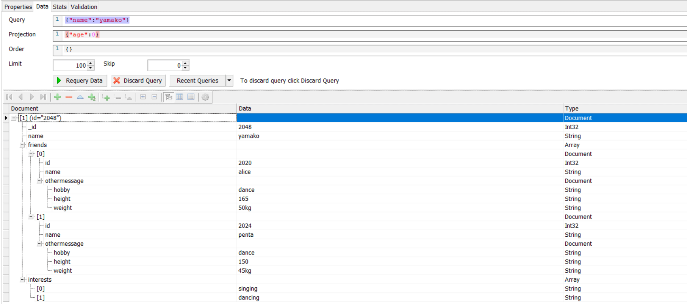

3. 查询嵌套字段

    对于三层嵌套结构来说，由于GUI界面可操作性较小，这里选择了使用shell工具来实现聚合管道
    
    示例：

    假设要查询到兴趣为旅行的人，且只显示姓名，朋友的姓名以及朋友的爱好，其他字段都不显示，那么需要做的是：
      - 使用 *$unwind* 操作符先展开数组
      - 使用 *$match* 操作符来匹配兴趣爱好是旅行的人
      - 使用 *$project* 操作符来显示姓名，朋友的姓名以及朋友的还好，并隐藏 *_id*
      - 将上面三条通过 *db.collection,aggregate* 方法聚合起来

    示例代码如下：
    ```
    db.People.aggregate([
      {$unwind:"$friends"},
      {$match:{"friends.othermessage.hobby":"travel"}},
      {$project:{"_id":0,"name":1,"friends.name":1,"friends.othermessage.hobby":1}}
    ])
   ```
  
    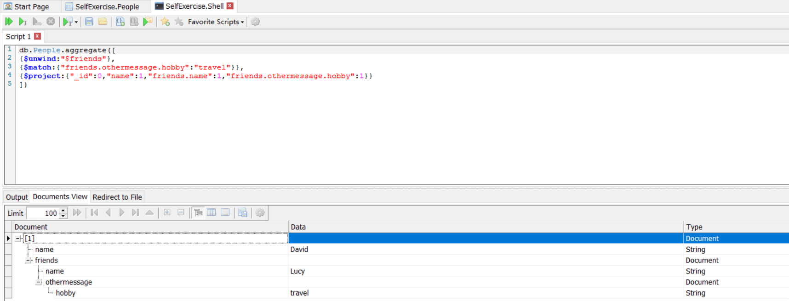

    最后返回的结果是：只有David的朋友Lucy爱好是旅行，且只显示了三条字段，和预期结果一致

## Order(排序)

1. 按单个字段升序排序：

    ```{"age":1}```

    按**age**字段升序排序
    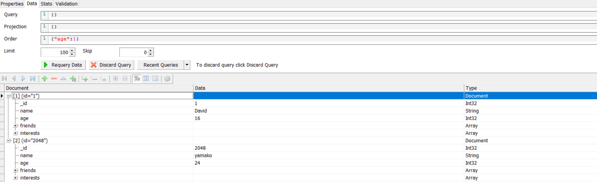

2. 按单个字段降序排序：

    ```{"age":-1}```

    按**age**字段降序排序
    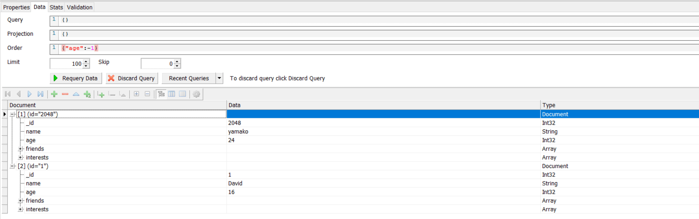

3. 按多个字段排序：

    ```{"age":1,"friends.name":-1}```

    先按**age**字段升序排序，再按朋友的名字**friends.name**降序排序
    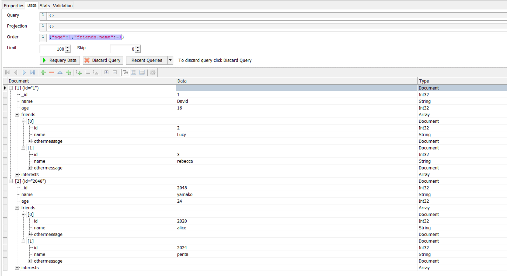