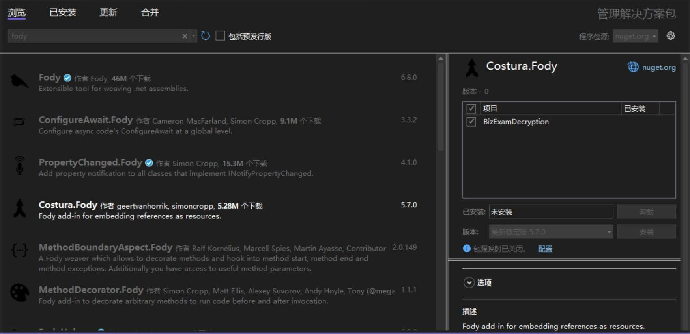

我发现界面活儿真的好考验审美啊，在同事的鞭策下改了几版之后，自认为审美得到了显著提升欸嘿
本篇将不断更新，记录在学习过程中遇到的问题和一些实用的工具
# 1 如何记录文件夹上次打开路径？
在 Settings.setting 中增加字段
# 2 如何在发布 release 版本时尽可能减少文件数量
发布时发现文件夹生成的文件数量略多，有一长串，想将它精简成一个 .exe 文件
经过高人指点,做出了以下改进：
- 使用了一个很好用的 nuget 包，这个包可以把 dll 塞在 exe 里，精简掉了 dll

  

- .config 文件可以直接删除，但是需要提前在 Settings.setting 文件中增加完足够的字段
> 如果没有增加足够的未被使用的字段的话，后续如果加上新的字段，则每次发布完必须带上 .config 文件才能正常运行
