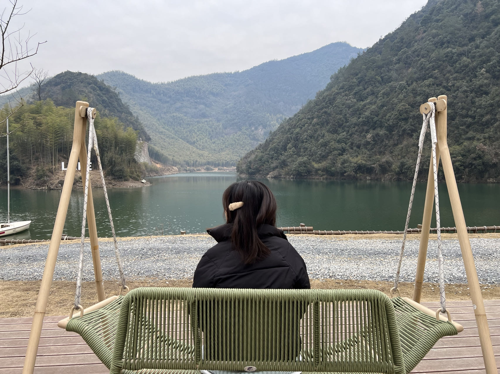

意外很多但是很快乐的一段旅行
# day1 Fri

出发时是下班高峰，发现租的车是外地牌照的，离开魔都的每一条路都格外小心，生怕违反禁行
高速公路沿路没有什么好吃的，忍！
路上感觉有点咳嗽，以为问题不大😷
到了酒店后发现！虽然住宿环境很不错，但是！！这地方也太偏了！没有吃的！也买不到药！😢
此时的我还没有意识到第二天会发生什么，还在一边自我安慰一边傻乐

# day2 Sat
美好的一天从酒店的自助早餐开始~
虽然种类很少但有我最爱的炒米线~
我足足吃了我朋友两倍量的早餐！胃口可好🤭
这时候的我有点头晕，但感觉还是问题不大，打算下午去市区的时候再买点药吃一下
于是出发，前往云下湖畔~

云下湖畔很美，很出片，就是这个季节还是太冷了！！
遇到了老大爷在烤火，过去蹭了蹭火，还是烤火暖和舒适，但是差点被炸开来的火星子给燎了！

下午去了浙江自然博物院安吉馆，好大！
还买了拼图集章卡，然后快乐盖章

但这个时候我的状态已经彻底不对劲了

发烧+骨头疼+头疼+头晕
硬撑着陪朋友逛完了馆
然后火速去市中心买药

虽然这药购买得不是那么方便，但真的很管用，至少止疼！
晚餐喝了很好喝的鸡汤，还吃了很好吃的笋！因为实在是吃不下了，就打包了一份白茶糯米糍耙，结果回酒店根本没人吃，笑死。
晚上在酒店的时候，今日最大意外发生了。
退烧药的副作用——拉肚子 出现了。
然后我把马桶炸了😱
字面意思
真的是
炸！！！
排泄物甚至喷射到盖子上了
我只能在清理完成后疯狂向我朋友鞠躬道歉
因为根本没办法100%清理完成
绝望，痛苦，懊悔
我为什么还活在这个世界上
悬着的心终于还是死了
呵，这令人绝望的一天

# day3 Sun
今天的日程是去云上草原滑雪！
依旧是嘎嘎炫的早饭
和吃一颗管半天的退烧药

还坐了小轮胎，可好玩了，芜湖起飞~

从天亮滑到天黑！

耐力满分~而且明显感觉白天比晚上雪质好~

至此，愉快的一天就结束啦~ 三天人均花了1708，属于小贵但还可以~感觉下次可以去别的滑雪场玩玩~