本篇只有如何使用轮子，没有造轮子。
起因是母上大人很喜欢一个微信公众号，但是那个公众号被和谐的很快，于是让我想办法把公众号的内容扒下来。
扒完后又有了新的需求，要我连留言内容一并扒下来，虽然有了现成的轮子，但操作起来还是有些许复杂，so......诞生了这篇文章
# 好用工具
项目地址：https://github.com/wechat-article/wechat-article-exporter
在线版地址：https://exporter.wxdown.online/
感谢这位大佬提供的超好用工具，是目前用下来最好用的
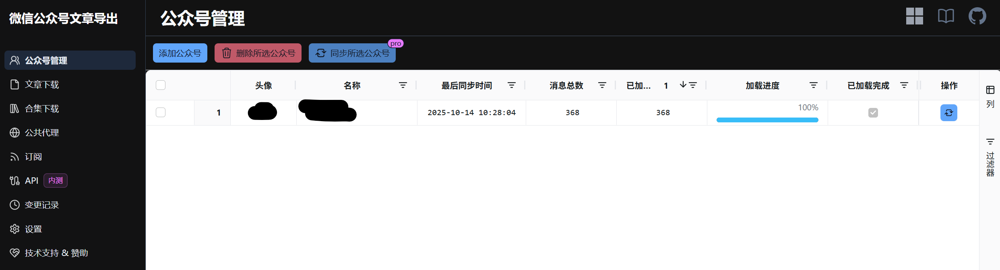
# 使用步骤
1. 首先，要注册一个微信公众号，这一步的目的是通过微信公众号管理平台来获取其他创作者的信息
2. 登录https://exporter.wxdown.online/
3. 点击“添加公众号”，搜索想要添加的公众号，选择后会自动拉取基本数据，这一步需要点时间，耐心等待
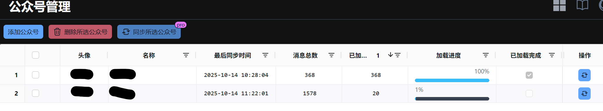
4. 等到加载完成后，来到文章下载页面，点击选择公众号，会出现这个账号下的所有文章
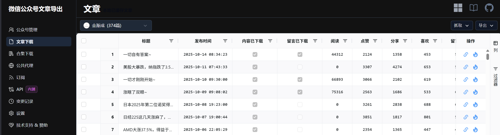
5. 抓取留言信息（最麻烦的一步）
  - 先点击右上角的小方框
    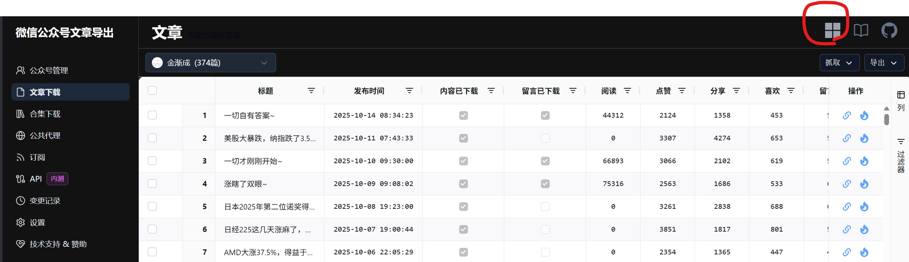
  - 下载软件并运行
    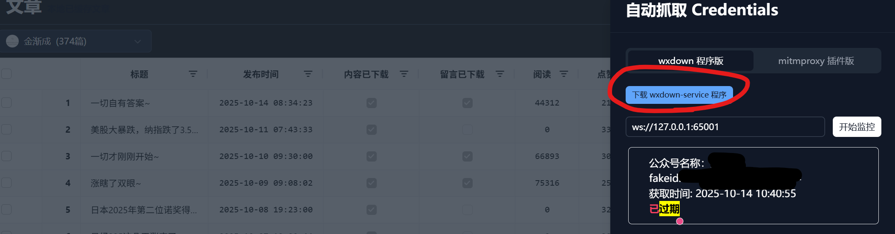
    运行时效果如下：
    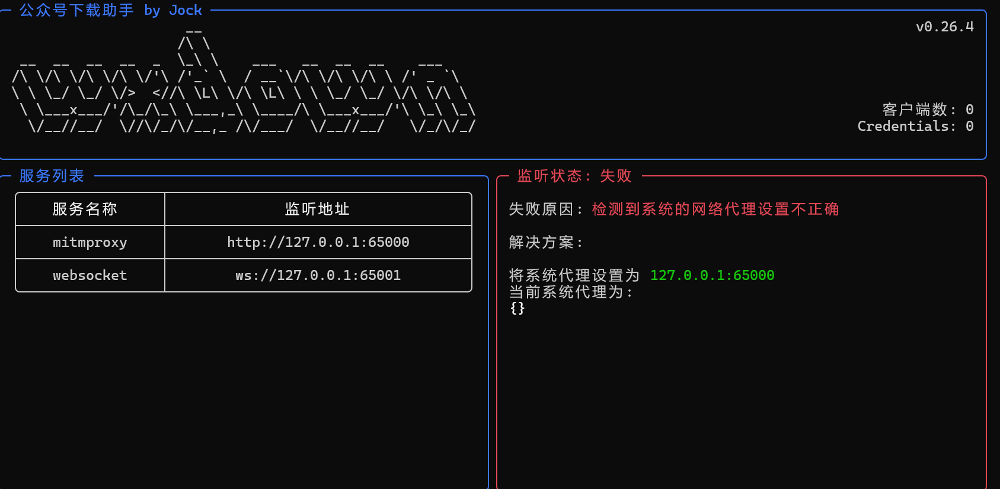
  - 更改网络代理，设置→网络和Internet→代理→手动设置代理→使用代理服务器
    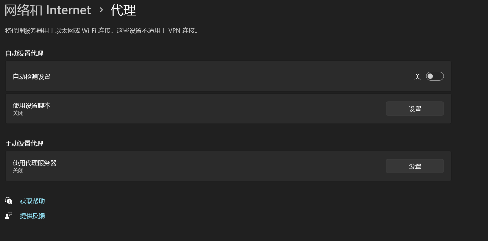
  - 将端口号改为65000并保存
  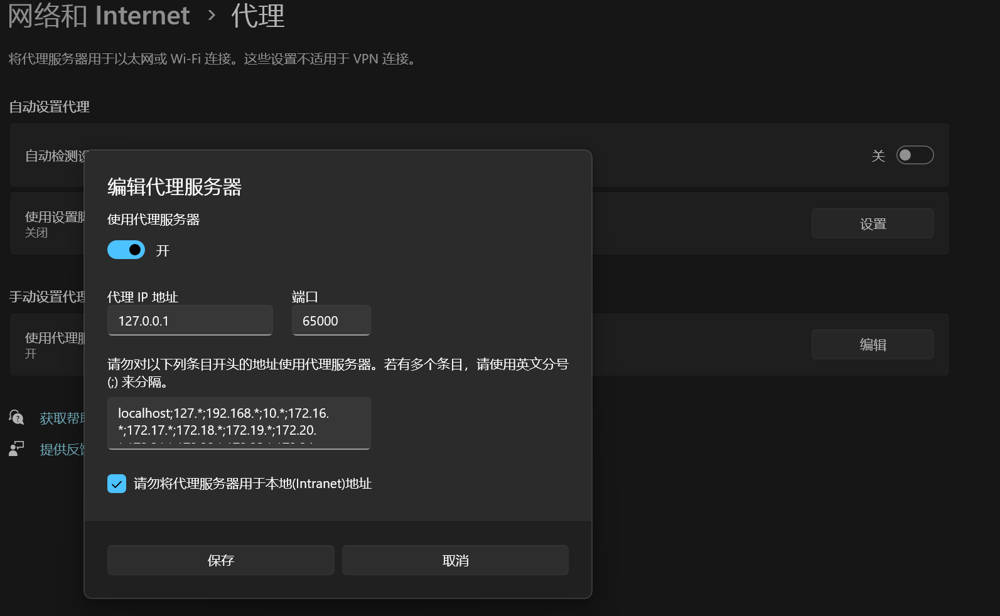
  - 返回运行中的程序，会看到
  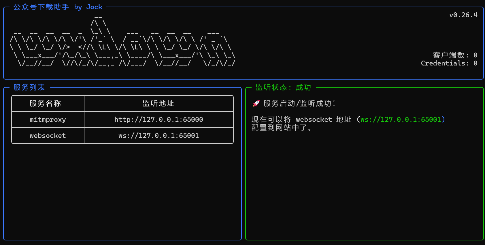
  - 回到网页，将地址填入页面中，点击开始监控
  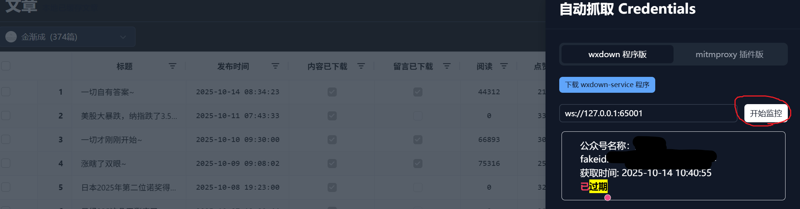
  - 使用电脑版微信打开那个公众号的任意一篇文章，会弹出隐私报错（没有的话就多点开几篇文章），点击高级→继续前往
  - 回到网页上会发现这时候显示credentials有效
  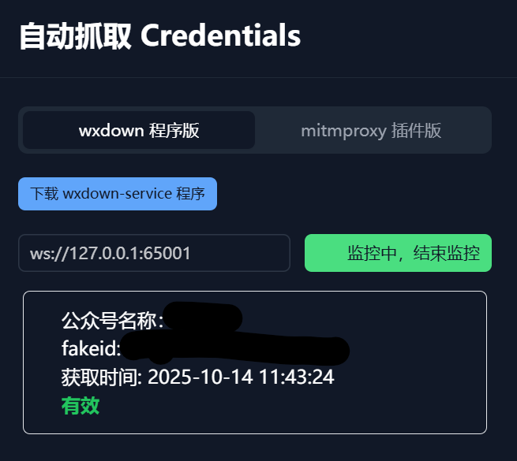
6. 点击抓取阅读量/留言内容，然后耐心等待
7. 导出为html
# 彩蛋
为了方便观赏，我将html转换为了epub，转换工具由ZYFDroid提供
只需要在电脑上安装RoslynPad后就可以使用Z师傅的神奇妙妙小脚本将网页变成电子书啦