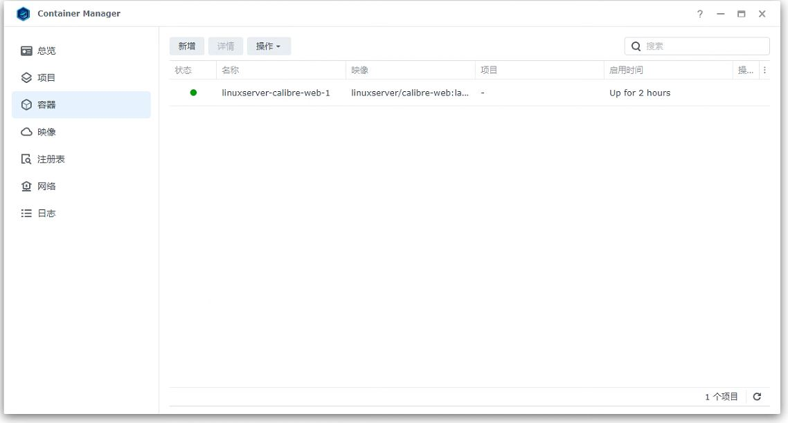

机型为```ds220j```，系统版本为```DSM7.2.1```
# 在Nas上使用calibre-web搭建个人图书库
## 容器配置
1. 去套件中心下载```container manager```套件，这是docker官方出的  
2. 在```container manager```中点击```注册表```，搜索```calibre-web```
   点击旁边的链接来查看该镜像的使用方法，**这是一个良好的使用习惯**
     
3. 直接点击该条目进行下载
     
4. 在群晖上，docker文件夹下新建一个```linuxserver-cabibre-books```文件夹，在这个文件夹下新建```books```和```config```两个文件夹
     
5. 在```映像```中找到刚刚下载好的```linuxserver/calibre-web```，点击该条目，再点击运行
     
6. 勾选```启用自动重新启动```
     
7. 在端口设置的本地端口中填入希望开放的群晖端口号，一般情况下为了方便记忆，和容器端口保持一致.  
   在存储空间设置中，填入刚刚在第四步中新建的文件夹路径，将```/books```和```/config```分别映射到```/docker/linuxserver-cabibre-books/books```和```/docker/linuxserver-cabibre-books/config```
  
8. 配置环境变量，按照图片中的内容进行添加  
    | 变量名                     | 值                              |
    | -------------------------- | ------------------------------- |
    | PUID                       | $(id -u)                        |
    | PGID                       | $(id -g)                        |
    | OAUTHLIB_RELAX_TOKEN_SCOPE | 1                               |
    | DOCKER_MODS                | linuxserver/calibre-web:calibre |
      
9. 勾选```使用高权限执行容器```
      
10. 手动添加空白的数据库文件
    在这里感谢大佬提供的教程和空白文件，建议去原文https://zhuanlan.zhihu.com/p/544504281 中自行寻找链接，或者将本地的数据库拷贝过来
    将下载/本地的文件放入```docker/linuxserver-cabibre-books/books```目录下  
11. 为```/docker/linuxserver-cabibre-books/books```文件夹及其所有子文件授予```EVERYONE```的```读取&写入```权限  
    
    >不这样做的话后续上传书本时会报错  
      
12.  在container manager的容器中找到刚刚配置好的容器并启动
      


至此，容器配置全部完成

## calibre-web使用指南
1. 输入Nas的ip地址+之前设置的端口号打开calibre-web的管理页面
   >在容器起来后需要等待一段很长的时间才能打得开页面，请耐心等待
2. 登录系统，初始用户名为```admin```，密码为```admin123```
3. 在数据库的位置中填入```/books```
   
4. 点击admin进入用户基本配置，建议第一时间修改密码，在这里也可以更改用户的系统语言
    
5. 点击```管理权限```，再点击```编辑基本配置```
   
   
6. 在```功能配置```中勾选```启用上传```
   
   Calibre电子书转换器路径为```/usr/bin/ebook-convert```  
   Calibre电子书转换器设置为```--enable-heuristics --chapter "//*[re:test(., '^\s*[第卷][0-9一二三四五六七八九十零百千两]*[章回部节集卷].*', 'i') or re:test(.,'^\s*序言|前言', 'i')]" --language zh --chapter-mark both --page-breaks-before "/" --no-default-epub-cover```  
   KEpubify电子书转换器路径设置为```/usr/bin/kepubify```  
   

7. 接下来就可以导入书本试试看啦。  
     如果遇到数据库权限不足的问题，请参考容器配置的第11步，为文件夹赋予权限后等待一段时间。

最后晒一下我的成果

   