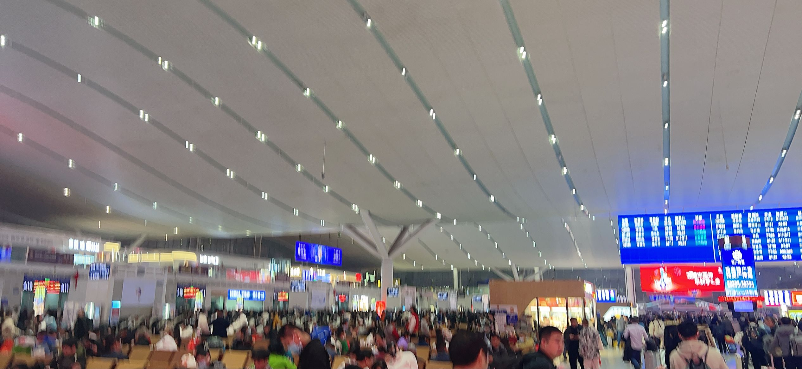
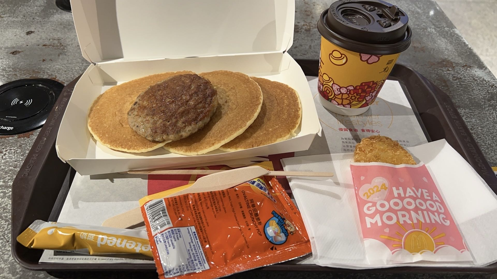
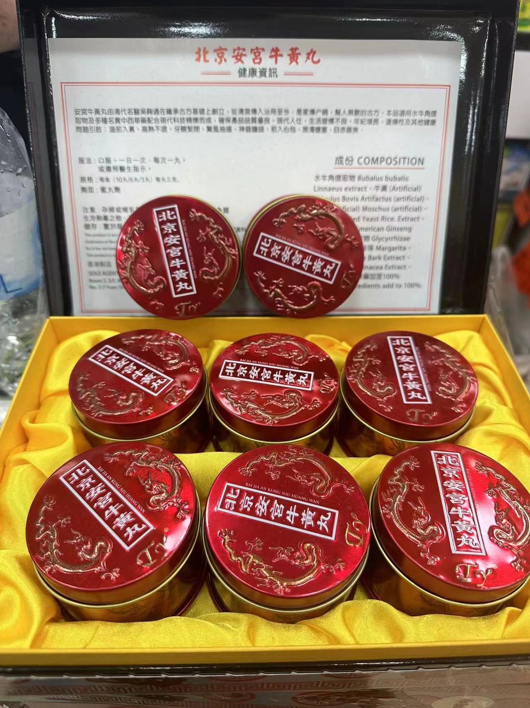
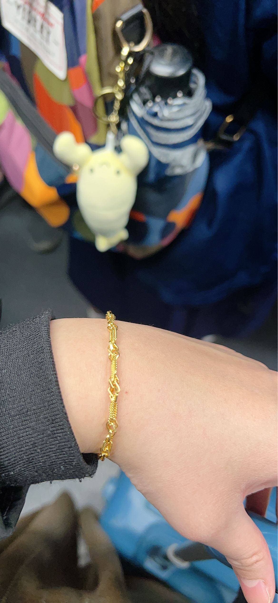

# 干货
香港银行开户主要分为预约和walkin两种
我本次去一共开了三个户，中银香港，汇丰One和ZABank
需要准备的材料有：
- 1.身份证
- 2.港澳通行证
- 3.过关小票（过香港海关时会给）
- 4.带地址的信用卡账单（作为地址证明和资产证明用）~但不是100%被查~
- 5.预约成功的截图~如果预约了的话~

可以提前做的事：
- 1.提前下好各大银行的app，如HSBC HK, BOCHK等
- 2.打扮得成熟且富有

## 中银香港
中国银行我是提前预约了，约了两家，第一家是上午9:00的美孚万事达广场分行，第二家是下午14:00的旺角总统商业大厦分行。
预约流程：关注微信公众号中银香港微服务——左下角银行服务——我要预约——预约开户——一般账户
选择地点注意*越偏越好过*！时间最好是上午第一个或者下午一个，通过率都会高。
但是因为我脸太嫩+刚去第一家经验不足，所以在美孚万事达广场分行被拒了，但是我总结了经验教训，并且在旺角总统商业大厦分行成功开户，以下是我总结的几个问答经验：
- 1.被问到什么用处时，回答投资理财
- 2.被问到是否之前有投资理财经验时，一定要回答是！！！
- 3.如果要求出示证明时，哪怕自己没有也不要慌，冷静回答“替父母炒过股/比特币/其他理财产品，用的是他们的账户”，然后马上打电话让父母截图他们的账户信息给你，并将截图给柜员看

要点是一定要冷静！冷静！冷静！看上去要非常老练、游刃有余！
当然，如果你运气够好的话，可能对面什么都不会问你，直接就给你开户了
但是中国银行的卡是邮寄的，要等
## HSBC
汇丰我是直接walkin的，在第一家中银把我拒了之后我直接就去了附近的汇丰，结果意外得人少也不严，就问了几个常规的问题就给我开户了。
也有可能是因为我开的是汇丰one，汇丰One的好处是没有管理费。
不是不想开汇丰卓越！而是需要户内存款50w，真的没有那么多小钱钱呜呜呜
汇丰有一点好，他家当场下卡，红色的小狮子真的很可爱。
## ZA Bank
ZA Bank是网上虚拟银行，我是在晚上等飞机的时候闲着无聊，本着来都来了的心态就顺势注册了，没有任何难点，唯一需要注意的是全部申请流程必须在香港境内，他会对IP地址和定位都有检测

# 碎碎念的日记
为了省钱，我是只请了一天假，然后前一天下班飞去深圳，从虹桥飞到宝安，在深圳北站附近睡了一晚,深圳酒店真的比香港便宜好多哦~但是深圳的环境真的好烂~
第二天一早从深圳北站坐高铁去西九龙~

深圳北站真的太夸张的，一大早就人山人海，比上海火车站还恐怖。
到了西九龙之后坐地铁屯马线直接到美孚，非常方便~
因为到得早还吃了麦麦！

大陆的麦麦都没有早餐全餐了，sad
下午开完户之后给我妈买了安宫牛黄丸嘿嘿，虽然不知道这玩意儿厉害在哪里，但是北京同仁堂全线打八折的情况下就他不打折！感觉应该确实有点东西的。

最后当然是爽逛周大福啦，1元工费真的太香了！！香港的金价真的比大陆便宜好多啊！羡慕！

满载而归~
但是最后回家的飞机晚点两个多小时，到家第二天还要上班，这才是真正的折磨！
本次往返+住宿共花费2167.45元~